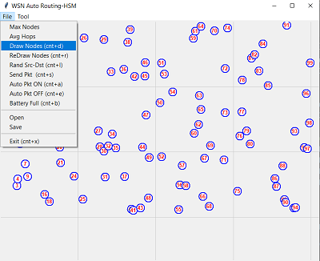
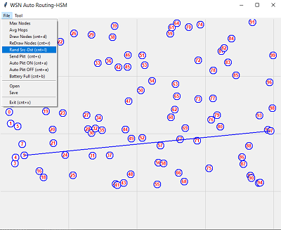
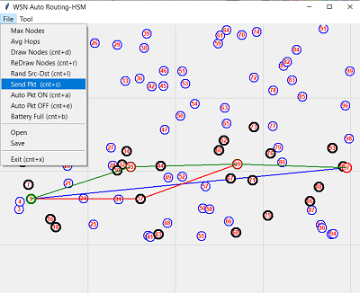
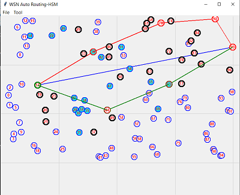

# WSN_Router
A Novel Energy Efficient Routing Algorithm for Wireless Sensor Network

Wireless sensor networks (WSNs) have become integral to various applications, necessitating energy-efficient strategies to extend their lifespan. This algorithm addresses the challenge of limited energy availability in wireless sensor nodes, which is particularly critical in applications where direct human intervention is impractical. A novel routing strategy involving both mobile and static sinks is proposed that optimizes retransmissions and puts low battery powered nodes in sleep.

Quick Start Steps-

1. Download the zip file and unzip in a folder ‘WSN_Router’.
2. Select ‘WsnRoutPwr.py’ file and load in VS Code
3. Install necessary library components in VC Code
4. Run WsnRoutPwr.py to popup 'WSN Auto Routing' application of figure-1
5. Open 'File' menu tab and press 'Draw Nodes (Cnt+d)' tab or press 'Control + d' to populate randomly distributed nodes as shown in figure-1. The default number of nodes are 100 and can be changed using ‘Max Nodes’ tab
6. Select a source and destination node pair from 'File' menu as shown in figure-2 or by simply pressing (Cnt+l)
7. Select and press 'File->Send Pkt (Cnt+s) from 'File' menu as shown in figure-3 or by simply pressing (Cnt+s). This will demonstrate data packet send

Figure-1 Simulation of a Wireless Sensor Network (WSN) with interactive GUI to demonstrate a new Novel Energy Efficient Routing Algorithm. Initially populate selected number of nodes, with random placement on canvas using 'File' menu of by simply pressing (Cnt+d)

Figure-2 Select a source and destination node pair from 'File' menu or by simply pressing (Cnt+l) 

***************************************  

Figure-3 Select a source and destination pair from 'File' menu of by simply pressing (Cnt+l) 

***************************************  

Figure-4 Simulation of a Wireless Sensor Network (WSN) with interactive GUI to demonstrate 
a new Novel Energy Efficient Routing Algorithm 

***************************************  

